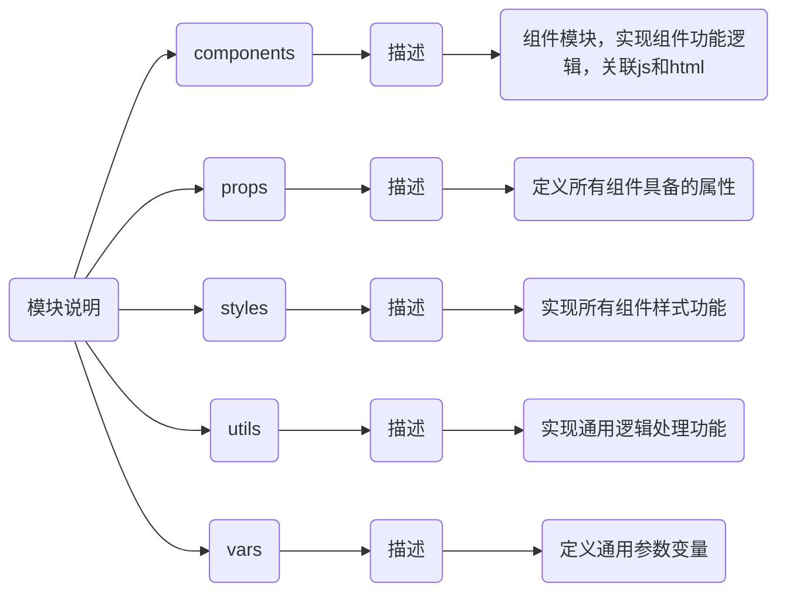

```mermaid
graph LR
A("模块说明")-->AA("components")-->AAA("描述")-->AAAA("组件模块，实现组件功能逻辑，关联js和html")

A-->AB("props")-->ABA("描述")-->ABAA("定义所有组件具备的属性")

A-->AC("styles")-->ACA("描述")-->ACAA("实现所有组件样式功能")

A-->AD("utils")-->ADA("描述")-->ADAA("实现通用逻辑处理功能")

A-->AE("vars")-->AEA("描述")-->AEAA("定义通用参数变量")
```
