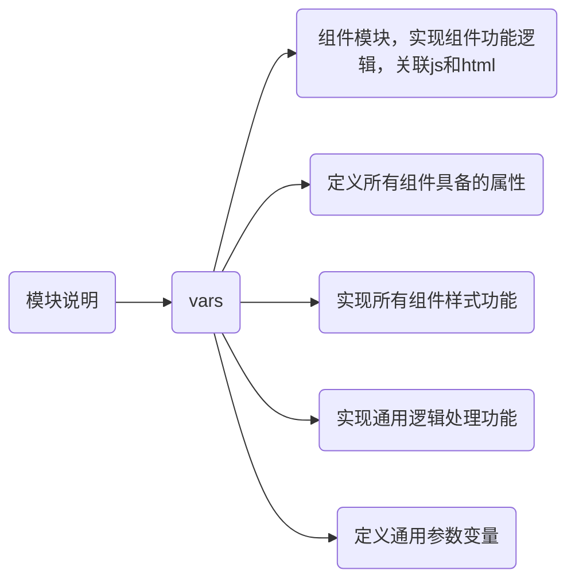

```mermaid
graph LR
A("模块说明")-->AA("components")-->AAA("组件模块，实现组件功能逻辑，关联js和html")
AA("props")-->AAB("定义所有组件具备的属性")
AA("styles")-->AAC("实现所有组件样式功能")
AA("utils")-->AAD("实现通用逻辑处理功能")
AA("vars")-->AAE("定义通用参数变量")
```
