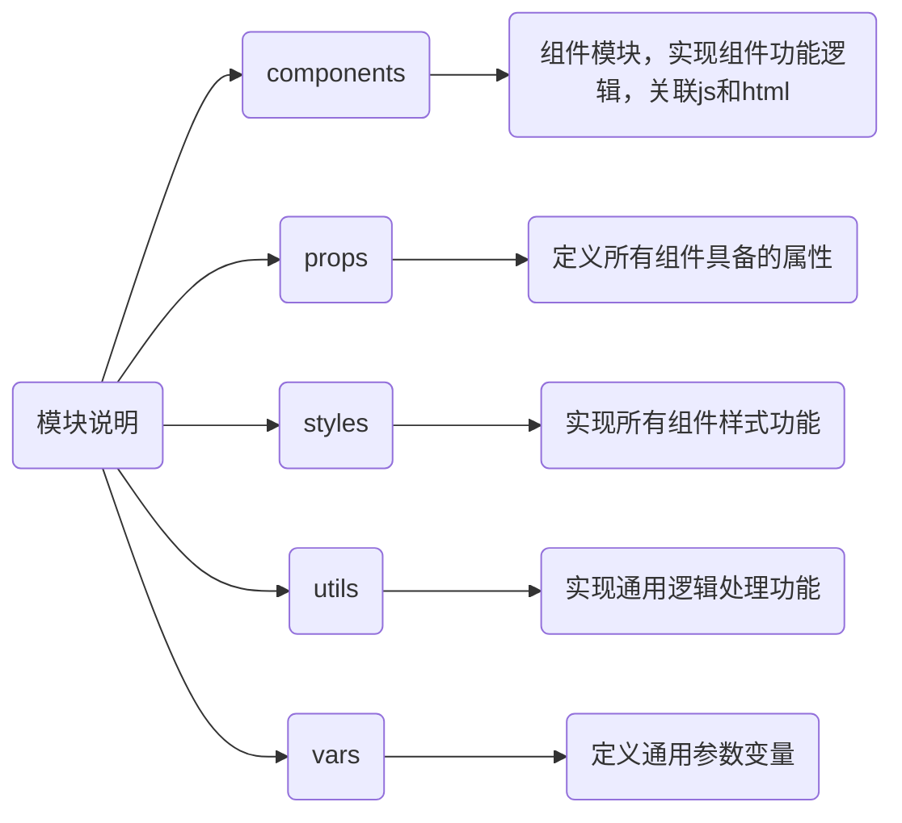

```mermaid
graph LR
A("模块说明")-->AA("components")-->AAA("组件模块，实现组件功能逻辑，关联js和html")
A-->AB("props")-->ABA("定义所有组件具备的属性")
A-->AC("styles")-->ACA("实现所有组件样式功能")
A-->AD("utils")-->ADA("实现通用逻辑处理功能")
A-->AE("vars")-->AEA("定义通用参数变量")
```
